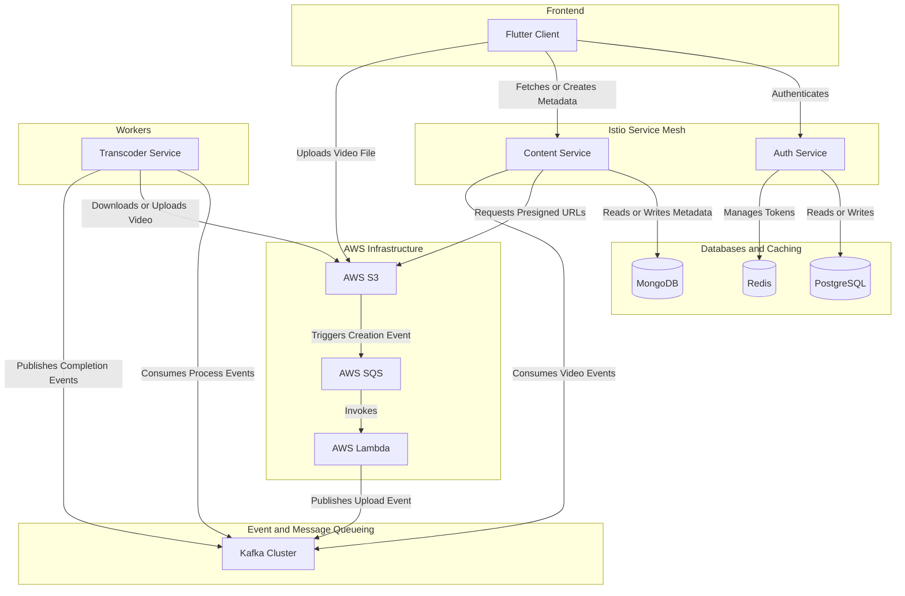

# System Architecture - Content Sharing Platform

## Architecture Diagram

The following diagram illustrates the key components of the system and how they interact to achieve the platform's core workflows:

## Repositories

The Content Sharing platform is organized into the following independent repositories:

*   **[auth_service](https://github.com/Exp-Content-Sharing/auth_service):** Responsible for user identity, registration, and session management using PostgreSQL and Redis.
*   **[client_service](https://github.com/Exp-Content-Sharing/client_service):** The cross-platform Flutter application serving web and mobile users.
*   **[content_service](https://github.com/Exp-Content-Sharing/content_service):** The primary orchestrator of the content lifecycle, managing metadata with MongoDB.
*   **[transcoder_service](https://github.com/Exp-Content-Sharing/transcoder_service):** A high-performance worker service handling CPU-intensive video processing tasks.
*   **[e2e_test_service](https://github.com/Exp-Content-Sharing/e2e_test):** Contains the end-to-end testing suite to ensure system reliability across all services.
*   **[infra_service](https://github.com/Exp-Content-Sharing/infra):** Manages the cloud infrastructure provisioning (AWS, Kubernetes) using tools like Terraform.
*   **[ops_service](https://github.com/Exp-Content-Sharing/ops):** Contains operational configurations, scripts, and deployment pipelines using tools like Helmfile and Ansible.